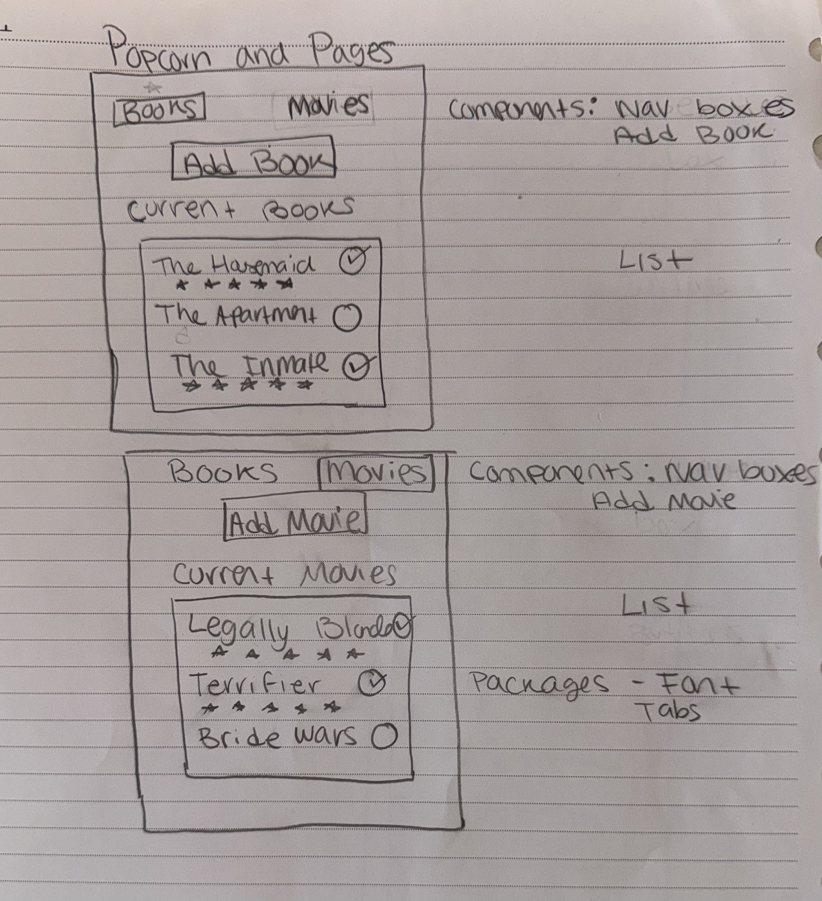

## PACKAGES 
### @expo-google-fonts/fredoka-one
### Tabs from expo Router

## Low- Fi Wireframe

### Book and Movie Web App ###
In designing this Book and Movie app, I implemented Human Interface Guidelines
by making sure the user experiences feels visually appealing. I focused on using
a clear navigation system by using the expo tabs, one for Book and one for
Movies. This allows users to easily switch back and forth between their book
and movie list.

My application is a read/watched movie app where you can add books or movies
by the title, rating and author/director. This will add them to a list where you
can mark them done or leave them blank if you havent gotten to them. 
The functionality I added was the motion detector to change the theme between
Forest, Sunrise, Midnight and Ocean. The themes are implemented using context and 
the books and movies are stored with Async storage. Wether the user closes out the 
app, the data and theme will still persist. 

According to the HIG guidelines, "consistent interface elements make it easier to complete tasks." I maintained consistency by:
- Using the same card-based layout for both Books and Movies screens
- Implementing identical "Add" components with matching input fields (title, author/director, rating)
- Using the same checkbox pattern for marking items as read/watched

